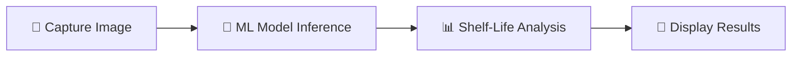

<h1 align="center">🍏 FreshCheck</h1>

<p align="center">
  <b>Smart Food Recognition & Shelf-Life Predictor</b><br>
  <em>Reduce food waste with AI-powered insights — fully offline 🚀</em>
</p>

<p align="center">
  
  
  
  
  
</p>

<p align="center">
  <a href="https://github.com/shushant882/freshcheck-android/stargazers">⭐ Star</a> •
  <a href="https://github.com/shushant882/freshcheck-android/issues">🐛 Issues</a> •
  <a href="https://github.com/shushant882/freshcheck-android/pulls">🤝 Contribute</a>
</p>

---

## 📱 App Preview

<p align="center">
  
  &nbsp;&nbsp;&nbsp;
  
</p>

---

## 🌟 Features

✨ **AI Food Recognition**  
📸 Detect fruits, vegetables, and pantry items instantly using on-device ML  

⏳ **Shelf-Life Prediction**  
Get estimated freshness duration based on food type  

📦 **Smart Storage Tips**  
Learn best practices to maximize food life  

🔔 **Expiry Alerts (Coming Soon)**  
Stay notified before food spoils  

🥗 **Inventory Management (Coming Soon)**  
Track your fridge & pantry efficiently  

---

## ⚙️ How It Works



1. Capture food image  
2. ML model classifies item  
3. App fetches shelf-life data  
4. UI shows actionable insights  

---

## 🧠 AI + Android Deep Dive

### 🤖 Machine Learning
- TensorFlow Lite model (`.tflite`)
- Trained on thousands of labeled food images
- Outputs probability-based classification

### 📱 Android Engine
- CameraX for image capture  
- Preprocessing (resize, normalize, rotate)  
- MVVM architecture for state handling  
- Jetpack Compose for reactive UI  

### ⚡ Edge AI Advantages
- 🚀 Zero latency  
- 🌐 Works offline  
- 🔒 Full privacy (no cloud upload)  

---

## 🛠 Tech Stack

| Layer | Technology |
|------|-----------|
| Language | Kotlin 🟣 |
| UI | Jetpack Compose 🎨 |
| ML | TensorFlow Lite 🤖 |
| Database | Room 🗄️ |
| Architecture | MVVM 🏗️ |

---

## 🏗 Architecture

```
UI (Compose)
   ↓
ViewModel
   ↓
Repository
   ↓
Room DB + ML Model
```

✔ Clean separation of concerns  
✔ Scalable & testable design  

---

## 🚀 Getting Started

### 1️⃣ Clone Repository
```bash
git clone https://github.com/shushant882/freshcheck-android.git
```

### 2️⃣ Open in Android Studio
- Use **Bumblebee or newer**
- Select **Open Existing Project**

### 3️⃣ Run the App
- Sync Gradle  
- Click ▶ Run  

---

## 🤝 Contributing

We ❤️ contributions!

```bash
# Fork repo
git checkout -b feature/your-feature
git commit -m "Add feature"
git push origin feature/your-feature
```

Then create a Pull Request 🚀

---

## 📄 License

Licensed under the **MIT License**

---

## ⚠️ Disclaimer

<p align="center">
  <em>
    FreshCheck provides predictive estimates only.<br>
    Always verify food safety manually before consumption.
  </em>
</p>

---

<p align="center">
  ⭐ If you like this project, don't forget to star it!
</p>
